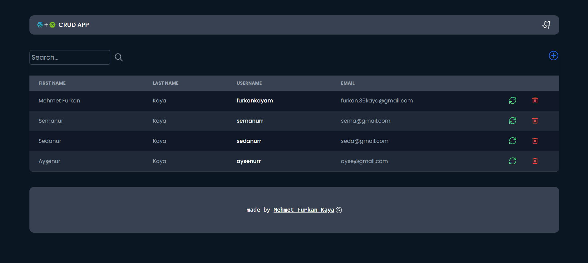
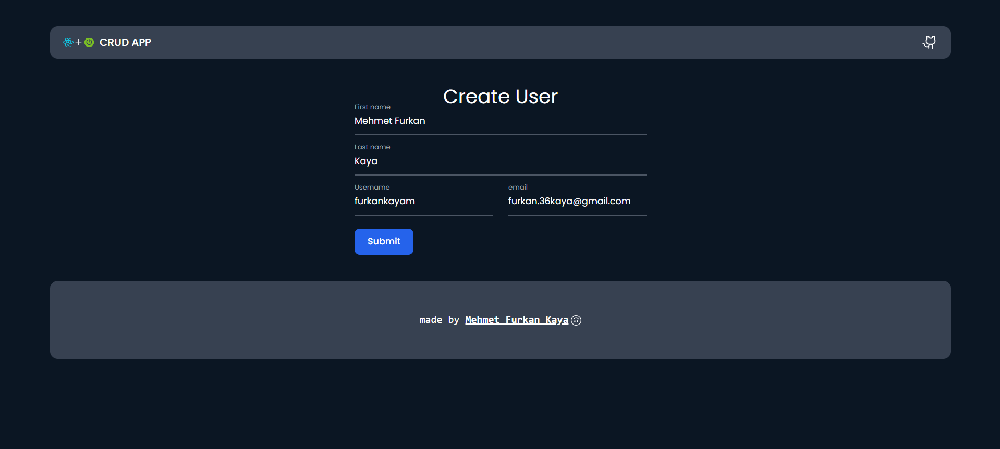
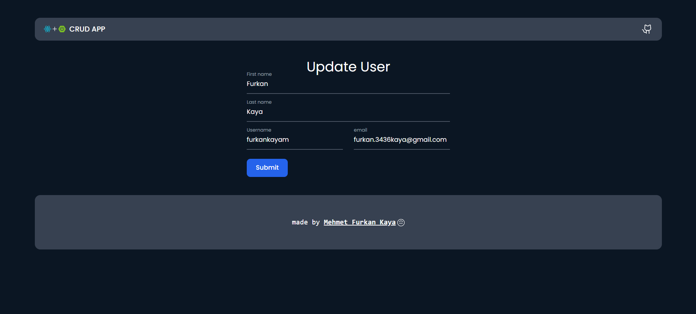
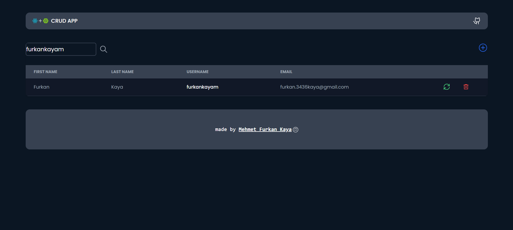
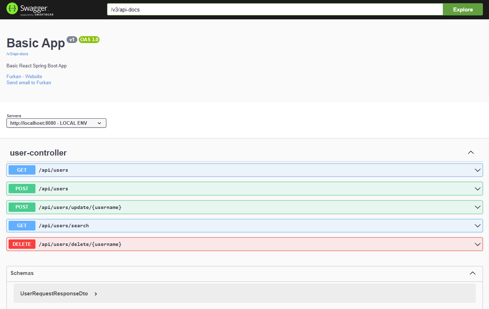
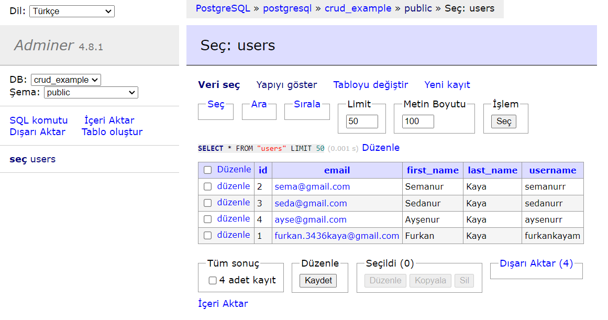
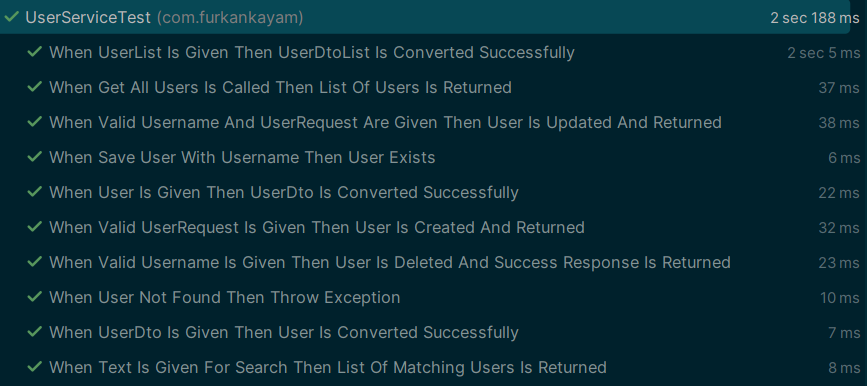
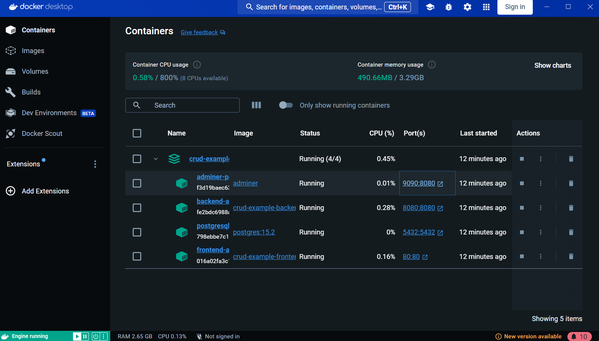

## 📃 `React + Spring Boot CRUD APP`

<br>

<div align="center">
<h3>⚡Home</h3>

<h3>⚡Create User</h3>

<h3>⚡Update User</h3>

<h3>⚡Search Users</h3>

<h3>⚡Swagger UI</h3>

<h3>⚡Database</h3>

<h3>⚡Test</h3>

<h3>⚡Docker Compose</h3>

</div>

<br>
<br>

- ✅ React + Spring Boot CRUD App

<br>

<br>

Used Technologies in The Project:

[](https://react.dev/)
[](https://redux-toolkit.js.org/)
[](https://tailwindcss.com/)
[](https://axios-http.com/docs/intro)
[](https://www.java.com/en/)
[](https://spring.io/)
[](https://www.postgresql.org/)
[](https://maven.apache.org/)
[](https://springdoc.org/)
[](https://docs.docker.com/)

<br>

### Installation

```bash
git clone https://github.com/furkankayam/react-springboot-crud-app.git
```

<br>

### Usage

```bash
docker-compose up
```

<br>

### URL

#### ▶️ UI

```bash
http://localhost
```

#### ▶️ Swagger UI

```bash
http://localhost:8080/swagger-ui.html
```

#### ▶️ Database

```bash
http://localhost:9090
```

- `rdbms`: PostgreSQL
- `username`: postgres
- `password`: postgres
- `database`: crud_example

<br>

<br>

# License

This project is licensed under the MIT License. See the [LICENSE](LICENSE) file for details

Created by [Mehmet Furkan KAYA](https://www.linkedin.com/in/mehmet-furkan-kaya/)
